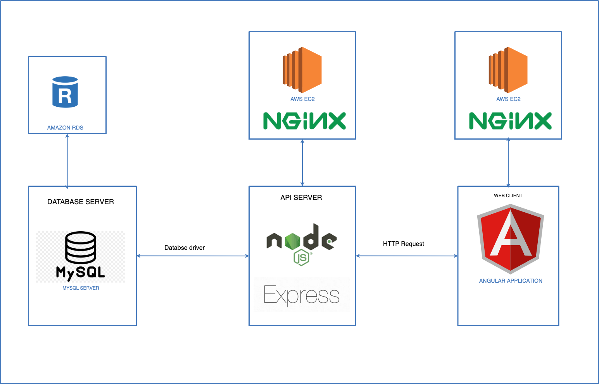
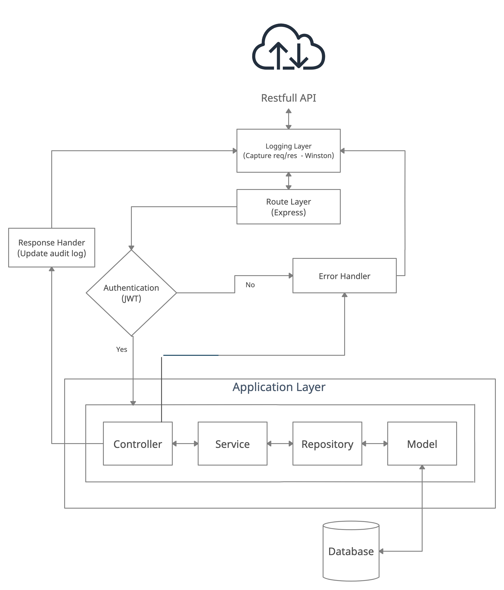
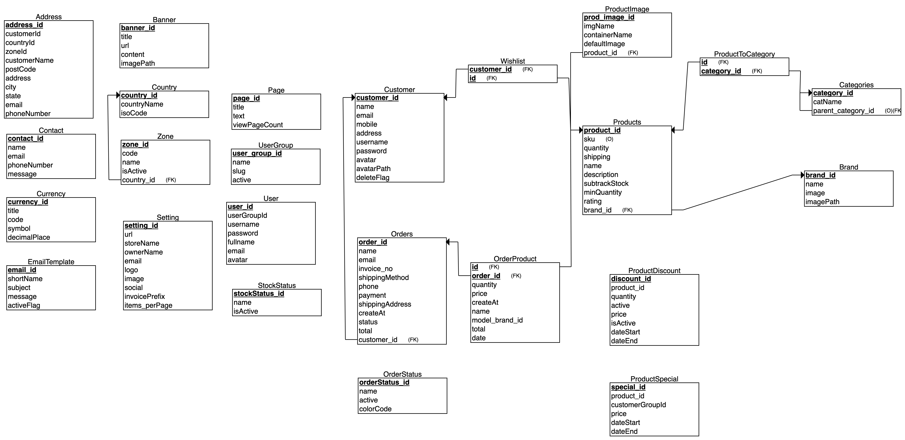
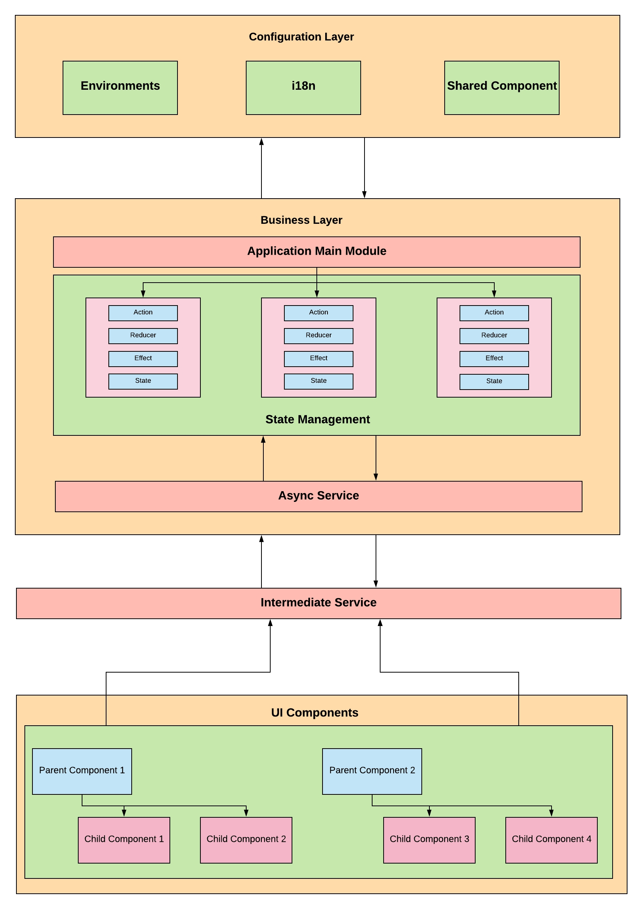
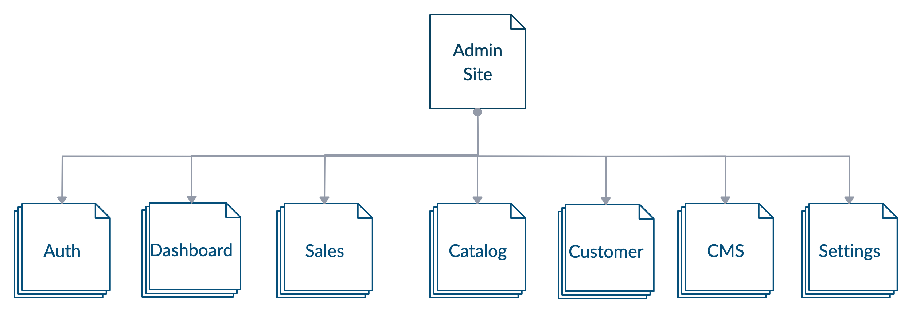
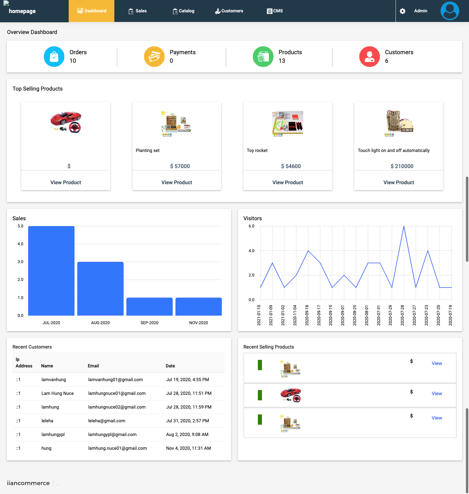
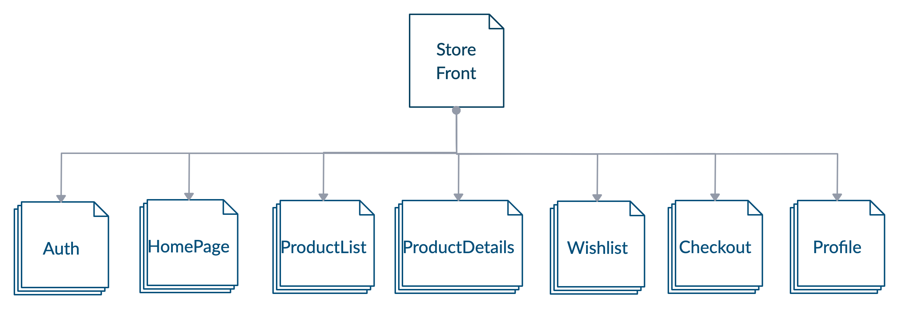
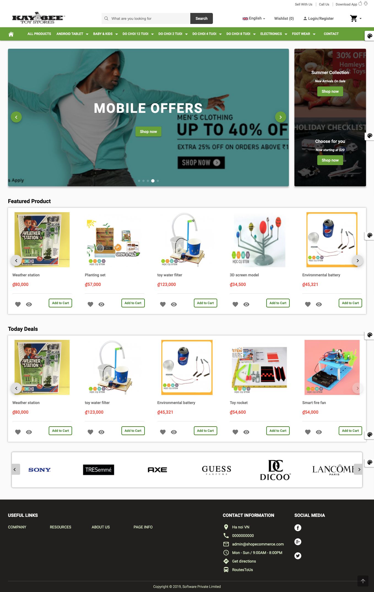

# iianian-ecom project: Express + Angular + TypeORM/MySql + TypeScript

Final project with Open Source JS modern tech stack. It provides common and nessary features of a standard eCommerce website.

iianian-ecom come with 3 part:

- iianian-ecom Restful API.
- iianian-econ Admin Control Panel.
- iianian-ecom Store Front.

| Reference | URL                                                   |
| --------- | ----------------------------------------------------- |
| API       | https://github.com/lamhungypl/iianian-ecom-api        |
| Admin     | https://github.com/lamhungypl/iianian-ecom-admin      |
| Storefont | https://github.com/lamhungypl/iianian-ecom-storefront |

# ❯ API Design

## Logic layers

- Model
- Repository
- service
- Controller
- Auth Guard
- ErrorHandler
- Logging

## Database

Simplify table design

## API Docs

[Sample API Docs](https://lamhungypl.github.io/iianian-ecom/public/apidoc/index.html)

# ❯ Frontend Architecture

## Logic layer

- Configuration
- Business

  Core function with Redux Store.

- Intermediate
- Representation

## User Interface

- Admin UI

- Storefront UI

